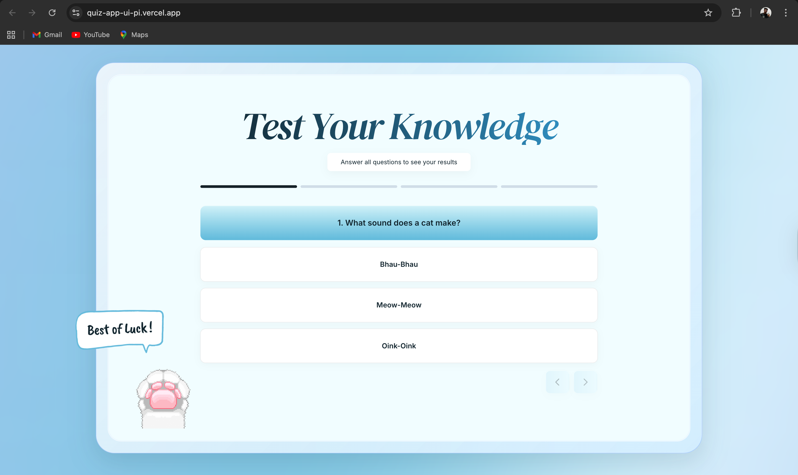
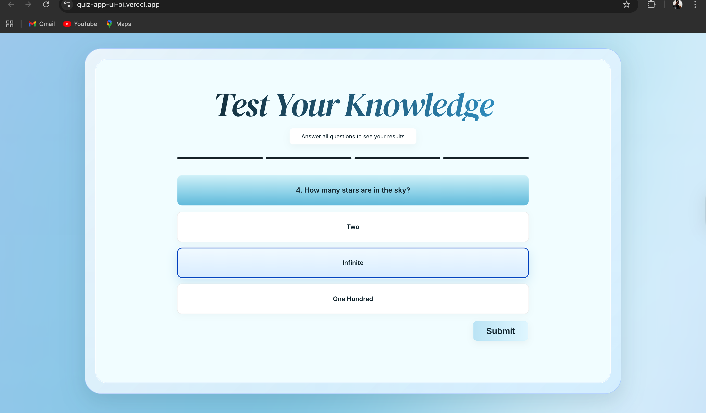
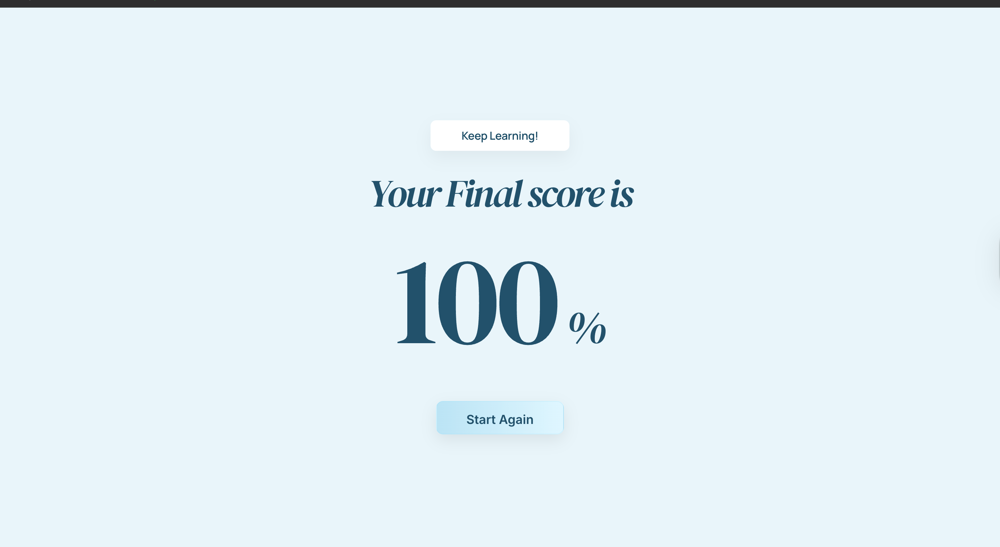

# Quiz Application

A beautiful, pixel-perfect quiz application built with React, TypeScript, Vite, and TailwindCSS. This README explains how the project works end to end and includes sample visuals of the experience.

**Live Demo**: https://quiz-app-ui-pi.vercel.app/

## How the Quiz Works

- **Data**: Questions live in `src/data/questions.ts` as an array of `{ id, question, options, correctAnswer }`.
- **Flow**: `Quiz.tsx` loads questions, tracks answers in state, and drives navigation. When the final question is submitted, it calculates your score and routes to `Result.tsx`.
- **UI**: Layout and animation are composed with small, focused components:
  - `ProgressBar` shows completion
  - `QuestionCard` renders the prompt
  - `AnswerOption` handles selection styles and clicks
  - `NavigationButtons` moves between steps and guards “Next” until an option is chosen
- **Scoring**: Correct answers are counted, converted to a percentage, and animated on the results screen using an ease-out counter.
- **Styling**: Tailwind powers the gradients, spacing, and responsive rules; custom tweaks live in `src/index.css` and `tailwind.config.js`.

## Sample Screens

The repo already includes assets used in the UI. These preview how the quiz looks out of the box.







## Features

- ✨ Modern, clean UI with soft blue gradients
- 📊 Multi-step progress bar
- 🎯 Multiple choice questions with interactive answer selection
- ➡️ Previous/Next navigation between questions
- 📈 Score calculation and animated result screen
- 🔄 Restart quiz functionality
- 🎨 Smooth animations and transitions
- 📱 Responsive design

## Getting Started

### Prerequisites

- Node.js (v16 or higher)
- npm or yarn

### Installation and Run

1) Install dependencies:
```bash
npm install
```

2) Start the development server:
```bash
npm run dev
```

3) Open your browser at `http://localhost:5173`.

### Build for Production

```bash
npm run build
```

The optimized build lives in `dist/`.

## Project Structure

```
src/
  components/
    ProgressBar.tsx       # Progress indicator component
    QuestionCard.tsx      # Question display component
    AnswerOption.tsx      # Individual answer option component
    NavigationButtons.tsx # Previous/Next navigation
  pages/
    Quiz.tsx              # Main quiz page
    Result.tsx            # Results page
  data/
    questions.ts          # Quiz questions data
  App.tsx                 # Main app component with routing
  main.tsx                # Entry point
```

## Customization

### Adding or Editing Questions

Update `src/data/questions.ts`:

```typescript
{
  id: 6,
  question: "Your question here?",
  options: ["Option 1", "Option 2", "Option 3"],
  correctAnswer: 1, // Index of correct answer (0-based)
}
```

### Styling

Tailwind handles most styling. Adjust theme tokens in `tailwind.config.js` and add global tweaks in `src/index.css`.

## License

MIT
